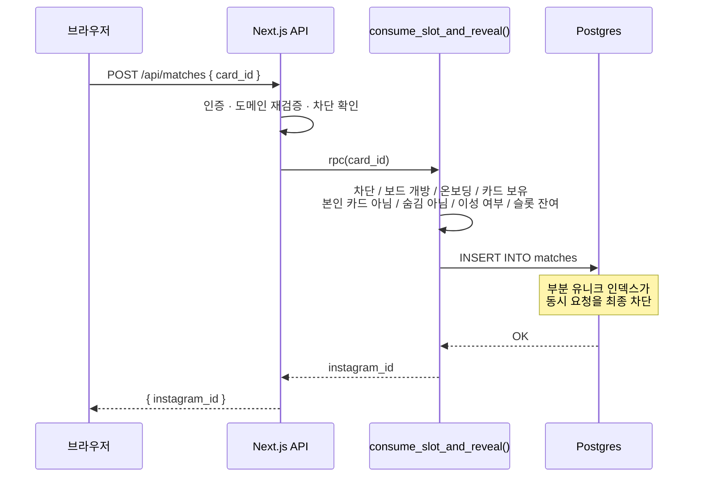

# 청대 시그널

청주대학교 학생 전용, **2일간만 열리는 인스타그램 매칭 웹앱**.

오프라인 "시그널" 행사(포스트잇 보드에 한 줄 소개를 적고 마음에 드는 사람의 인스타 ID를 받아가는 방식)를
그대로 웹으로 옮기되, 오프라인에서 매번 터지던 문제들을 구조적으로 막는 것이 목표였다.

| 오프라인의 문제 | 이 앱의 해법 |
|---|---|
| 줄 서기 · 보드 정리가 안 됨 | 등록/노출/매칭 전부 자동화 |
| 손글씨 인스타 ID를 못 알아봄 | 텍스트 입력 + 클립보드 복사 |
| 성비가 무너지면 다들 포기함 | 양쪽 임계 인원을 채워야 보드 오픈 + 실시간 성비 표시 |
| 한 사람이 인스타를 쓸어 담음 | **1 계정 = 1 카드 = 1 열람**, 되돌릴 수 없음 |

**Stack** — Next.js 15 (App Router) · React 19 · TypeScript · Tailwind v4 · Supabase (Postgres / Auth / RLS) · Vercel

---

## 왜 데이팅 앱을 쓰지 않는가

같은 목적의 앱은 이미 많다. 이 서비스가 다른 지점은 기능이 아니라 **제약**에 있다.

**사진이 없다.** 카드에 담기는 건 **20자 한 줄**이 전부다.
외모 서열이 아니라 한 줄을 잘 쓴 사람이 선택받는다.
"강동원 닮은꼴" 다섯 글자로 승부가 갈리는 게임은 스와이프와 완전히 다른 물건이다.

**행사이지 앱이 아니다.** 데이팅 앱 설치는 사회적 신호를 남기지만
"우리 학교 시그널"은 친구에게 말할 수 있는 놀이다. 이 차이가 유입 장벽을 결정한다.

**동시에 열리고 동시에 닫힌다.** 상시 서비스는 아무나 아무 때나 들어와
매칭 풀이 늘 희석되어 있다. 2일 한정은 **"지금 우리 학교 사람들이 다 같이 들어와 있다"**는
상태를 만든다. 상시 운영으로는 만들 수 없는 조건이다.

**1회로 끝난다.** 무한 스와이프의 반대편에서, 한 번뿐이라는 제약이 선택을 신중하게 만든다.

**흔적을 남기지 않는다.** 행사가 끝나면 전량 폐기한다.
개인정보보호법 준수를 위한 설계였지만, 결과적으로 운영 부담까지 없앴다 —
쌓이는 사용자 DB가 없으므로 상시 관리 의무도, 시간이 갈수록 커지는 유출 위험도 없다.

한계도 분명하다. 임계점 게이팅은 **입장 조건**이지 **유지 조건**이 아니어서,
시작 후 성비가 기우는 것은 현재 구조로 막지 못한다.
대응 방향은 [로드맵](docs/roadmap.md)에 정리했다.

---

## 핵심 제약과 설계

이 서비스의 가치는 전부 하나의 불변식에서 나온다.

> **한 사람은 평생 딱 한 명의 인스타그램 ID만 볼 수 있다.**

이게 깨지면 서비스는 "인스타 ID 수집기"가 된다. 그래서 설계의 대부분이 이 불변식을 지키는 데 쓰였다.

### 신뢰 경계를 어디에 둘 것인가

Supabase를 쓰면 **anon key가 브라우저 번들에 그대로 실린다.** 이건 유출이 아니라 설계상 공개된 값이다.
따라서 공격자는 이 앱의 API 라우트를 **완전히 건너뛰고** PostgREST를 직접 호출할 수 있다.

```
❌ 이렇게 생각하면 안 된다
   브라우저 ──> Next.js API (검증) ──> DB

✅ 실제 구조
   브라우저 ──> Next.js API (검증) ──> DB
        └──────── 직접 호출 가능 ───────┘
```

그래서 **애플리케이션 코드는 UX 계층으로만 취급하고, 진짜 인가는 전부 Postgres 쪽에 두었다.**

| 계층 | 역할 |
|---|---|
| Row Level Security | 누가 어떤 **행**을 볼 수 있는가 |
| 컬럼 단위 GRANT | 누가 어떤 **컬럼**을 볼 수 있는가 (`instagram_id`) |
| `SECURITY DEFINER` 함수 | 검증을 통과했을 때만 민감 데이터를 반환 |
| 부분 유니크 인덱스 | 동시 요청에도 슬롯이 두 번 소비되지 않도록 |

### 슬롯 소비 흐름



`instagram_id`는 이 함수와 `my_matches()`를 통해서만 서버 밖으로 나간다.
일반 롤에는 애초에 그 컬럼의 `SELECT` 권한이 없다.

---

## 설계 리뷰에서 발견한 것들

배포 이후 전 구간 보안 리뷰를 진행했다. 다음은 실제로 발견해 수정한 문제들이다.

### 1. 컬럼 단위 `REVOKE`가 아무 효과도 없었다

```sql
-- 의도: 인스타 ID 컬럼을 못 읽게 막는다
revoke select (instagram_id) on public.cards from anon, authenticated;
```

PostgreSQL에서 **테이블 단위 권한을 이미 가진 롤에 컬럼 단위 `REVOKE`를 실행하면 무시된다.**
경고만 남고 권한은 그대로다. Supabase는 `public` 스키마 테이블에 `anon`/`authenticated`로
테이블 단위 권한을 기본 부여하므로, 위 한 줄은 아무 일도 하지 않았다.

```sql
-- 실제로 동작하는 방법: 테이블 권한을 먼저 회수하고 허용 컬럼만 재부여
revoke all on public.cards from anon, authenticated;
grant select (id, user_id, one_liner, color, hidden_by_user, hidden_by_admin,
              created_at, updated_at) on public.cards to authenticated;
```

검증: `select has_column_privilege('authenticated','public.cards','instagram_id','SELECT')` → `false`

### 2. RLS 정책 안의 서브쿼리에도 RLS가 적용된다

보드 조회 정책은 "상대의 성별이 나와 다를 것"을 확인해야 했다.

```sql
and me.gender != (select gender from public.users where id = cards.user_id)
```

그런데 `users`에는 "본인 행만 조회 가능" 정책이 걸려 있었다.
**정책 표현식 내부의 서브쿼리도 대상 테이블의 RLS를 그대로 받는다.**
따라서 이 서브쿼리는 항상 0행 → `NULL` → 비교 결과 `NULL` → `EXISTS` 거짓.

**보드가 모든 사용자에게 항상 빈 배열을 반환하고 있었다.** 교차 테이블 조회는
`SECURITY DEFINER` 함수로 감싸야 한다.

### 3. 두 버그가 서로를 가리고 있었다

이게 이 프로젝트에서 가장 인상 깊었던 부분이다.

- **(A)** `instagram_id` 컬럼 보호가 무효 → 원래는 전량 유출 가능
- **(B)** 보드 정책이 0행 반환 → 서비스가 동작하지 않음

**(B) 때문에 (A)가 실현되지 않고 있었다.** "보드가 안 열린다"는 눈에 띄는 버그만 고쳤다면,
그 배포 순간 참가자 전원의 인스타 ID가 열렸을 것이다.
두 수정은 반드시 같은 마이그레이션에 담아야 했다.

### 4. 슬롯 제약을 애플리케이션 로직에만 의존하지 않기

```sql
create unique index matches_one_per_viewer_nonbonus
  on public.matches (viewer_user_id) where bonus = false;
```

함수 내부의 `count → insert`는 read-then-write라 동시 요청에 취약하다.
부분 유니크 인덱스가 최종 방어선이 되고, 함수는 `unique_violation`을 잡아
`SLOT_ALREADY_USED`로 변환한다.

한편 `matches`에 대한 일반 롤의 직접 `INSERT`는 아예 회수했다.
정책이 `bonus` 컬럼을 검사하지 않아, `bonus = true`로 직접 삽입하면
부분 인덱스(`where bonus = false`)를 우회할 수 있었기 때문이다.

### 5. 그 밖에

- 이메일 도메인 검증이 매직링크 발급 라우트에만 있었다 → 인증 경계 전체 + DB `CHECK` 제약으로 확장
- `users` 자기수정 정책에 컬럼 제한이 없어 `banned` 자가해제 · 성별 위조가 가능했다 → 쓰기 권한 회수, 온보딩을 1회성 RPC로 이전
- 차단이 세션을 폐기하지 않아 실효가 없었다 → refresh token 전역 폐기
- 카드 물리 삭제가 `on delete cascade`로 **타인의** 매칭 기록을 지워 슬롯을 되살렸다 → 소프트 삭제로 전환
- 매직링크 쿨다운이 클라이언트에만 있어 메일 발송 할당량을 소진시킬 수 있었다 → 서버측 원자적 한도 도입

---

## 검증

인가가 DB에 있으므로, 테스트도 **애플리케이션을 우회해서** 해야 의미가 있다.
`scripts/verify-security.mjs`는 공개 anon key와 실제 사용자 JWT로 PostgREST를 직접 호출한다 —
공격자와 정확히 같은 경로다.

```
$ node --env-file=.env.local scripts/verify-security.mjs

[비로그인 방문자]
  PASS  session_config를 읽을 수 있다
  PASS  cards.instagram_id 직접 조회가 막힌다

[로그인한 학생 — 공개 anon 키 + 본인 JWT로 DB 직접 호출]
  PASS  instagram_id 컬럼 조회가 거부된다
  PASS  RLS가 이성 카드를 통과시킨다
  PASS  보드 목록에는 본인 카드가 빠진다
  PASS  matches 직접 INSERT가 거부된다
  PASS  users 자기수정(차단 해제·성별 변경)이 거부된다
  PASS  hidden_by_admin 자기해제가 거부된다
  PASS  users 자기삭제(슬롯 리셋)가 거부된다

[정상 기능이 여전히 동작하는가]
  PASS  인원 집계가 실제 등록 수를 반환한다
  PASS  슬롯 소비 → 인스타 ID가 정상 반환된다
  PASS  두 번째 슬롯 소비는 SLOT_ALREADY_USED로 거부된다
  PASS  내 매칭에서 인스타 ID를 다시 볼 수 있다
  PASS  이미 본 카드는 보드에서 사라진다

결과: 14 PASS / 0 FAIL
```

> ⚠️ 이 스크립트는 매칭 기록을 삭제하고 세션 설정을 덮어쓴다.
> 사용자 수가 임계치를 넘으면 스스로 실행을 거부하지만, 운영 중에는 돌리지 말 것.

입력 검증은 별도 유닛 테스트로 다룬다 (`npm test`, 23개).
한 줄 소개 길이는 DB의 `char_length`와 맞추기 위해 **UTF-16 단위가 아니라 코드포인트로** 센다.

---

## 개인정보 보호

실제 학생의 이메일·성별·인스타그램 ID를 다루므로 개인정보보호법이 적용된다.

- 수집 항목을 최소화하고, **행사 종료 후 7일 이내 전량 파기**
- 사용자가 앱 내에서 언제든 즉시 삭제 가능 (`auth.users`까지 삭제)
- 처리방침에 보호책임자·국외 이전·파기 절차·권익침해 구제방법 명시 (`/privacy`)
- 인스타그램 ID는 슬롯을 사용해 열람한 1인에게만 공개

---

## 로컬 실행

```bash
npm install
cp .env.example .env.local        # 값 채우기
npx supabase link --project-ref <YOUR_PROJECT_REF>
npx supabase db push
npm run dev
```

```bash
npm test          # 유닛 테스트
npm run build     # 프로덕션 빌드
```

### 환경변수

| 이름 | 설명 |
|---|---|
| `NEXT_PUBLIC_SUPABASE_URL` | Supabase 프로젝트 URL |
| `NEXT_PUBLIC_SUPABASE_ANON_KEY` | 공개 anon key (브라우저에 노출됨 — 정상) |
| `SUPABASE_SERVICE_ROLE_KEY` | 서버 전용. RLS를 우회하므로 절대 클라이언트로 넘기지 말 것 |
| `ADMIN_EMAIL` | 어드민 콘솔 접근 이메일. **`NEXT_PUBLIC_` 접두사 금지.** 미설정 시 아무도 접근 불가(fail-closed) |
| `NEXT_PUBLIC_SITE_URL` | 매직링크 복귀 주소의 기준이 되는 배포 URL |

---

## 디렉터리

```
app/
  api/            route handlers (인증 · 카드 · 보드 · 매칭 · 어드민)
  auth/callback   매직링크 복귀 지점 (해시 / token_hash / code 세 형태 모두 처리)
  board/          보드 + 임계점 게이팅
  admin/          운영 콘솔
lib/
  auth.ts         인증 + 도메인 재검증 + 차단 확인
  auth-flow.ts    로그인 직후 공통 마무리
  supabase/       server / browser / service-role 클라이언트
  validation/     한 줄 소개 · 인스타 ID · 이메일 · 비속어 · 전화번호
supabase/migrations/
  0001~0005       스키마 · RLS · 암호화 RPC · 스케줄러
  0006            RLS/권한 전면 수정 (위 "설계 리뷰" 항목)
  0007~0008       매직링크 발송 한도
scripts/
  verify-security.mjs   PostgREST 직접 호출 기반 인가 검증
docs/
  roadmap.md      측정 지표 · 확장 브랜치 계획 · 수익화 검토
  superpowers/
    specs/        디자인 스펙
    plans/        구현 계획
```

---

## 운영 메모

- 행사 시각·임계 인원은 어드민 콘솔 또는 `session_config` 테이블에서 설정한다
- `force_locked = true`로 즉시 보드를 잠글 수 있다 (응급용)
- 커스텀 SMTP를 쓸 경우 Supabase의 **Authentication → Rate Limits** 발송 한도도 함께 올려야 한다.
  기본값(시간당 30건)은 수백 명 규모에 부족하다
- 데이터 폐기는 자동화하지 않았다. 어드민이 명시적으로 실행한다
